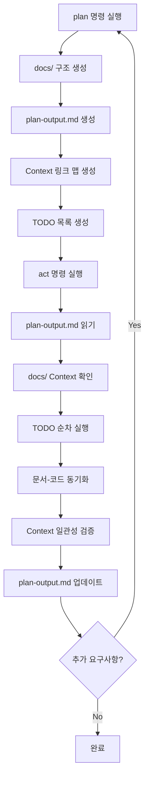

# 작업 실행 규칙 (Document-Driven TDD)

ultrathink. plan-output.md를 기반으로 문서 주도 TDD 방식으로 작업을 실행하세요.

## 🚨 필수 실행 순서

### STEP 0: Context 및 계획 확인
```
MUST DO FIRST:
1. plan-output.md 읽기 → REQUIRED:
   - 프로덕트 사양 (비즈니스 Context)
   - 아키텍처 설계 (기술 Context) 
   - 도메인 모델 (비즈니스 로직 Context)
   - API 명세 (계약 Context)
   - 테스트 계획 (품질 Context)
   - TODO 목록 및 진행 상태 (작업 Context)
2. docs/ 폴더 구조 확인:
   - docs/product/ 링크 확인
   - docs/architecture/ 링크 확인
   - docs/domain/ 링크 확인
   - docs/api/ 링크 확인
   - docs/testing/ 링크 확인
3. IF (plan-output.md 없음 OR TODO 목록이 비어있음):
   → 오류: "plan 명령을 먼저 실행하여 Context를 설정하세요"
```

### STEP 1: Context-Driven TDD 사이클 실행
```
WHILE (plan-output.md에 미완료 TODO 존재):
    1. 작업 선택 (docs-* → test-* → impl-* → refactor-* 순)
    2. Edit plan-output.md → 선택된 TODO를 "진행중" 상태로 표시
    3. 관련 Context 문서 읽기:
       - Read docs/[domain]/[관련문서].md
       - 비즈니스 규칙, 아키텍처 제약사항 확인
    
    === DOCUMENT PHASE (docs-*) ===
    4. IF (작업이 docs-*):
       - plan-output.md의 링크를 참조하여 상세 문서 작성
       - 도메인 모델, API 명세, 테스트 시나리오 문서화
       - Write docs/[category]/[document].md
       - Edit plan-output.md → 해당 TODO를 체크 완료로 표시
    
    === RED PHASE (test-*) ===
    5. IF (작업이 test-*):
       - docs/testing/에서 테스트 전략 확인
       - docs/domain/에서 비즈니스 규칙 확인
       - 실패하는 테스트 작성 (Given-When-Then 패턴)
       - Bash로 테스트 실행 → 실패 확인
       - Edit plan-output.md → 해당 TODO를 체크 완료로 표시
    
    === GREEN PHASE (impl-*) ===
    6. IF (작업이 impl-*):
       - docs/architecture/에서 설계 제약사항 확인
       - docs/api/에서 인터페이스 계약 확인
       - 최소한의 코드로 테스트 통과 (Clean Architecture 준수)
       - Bash로 테스트 실행 → 성공 확인
       - Edit plan-output.md → 해당 TODO를 체크 완료로 표시
    
    === REFACTOR PHASE (refactor-*) ===
    7. IF (작업이 refactor-*):
       - 코드 개선 (SOLID 원칙 적용)
       - 테스트는 계속 통과 유지
       - Bash로 테스트 재실행 → 성공 확인
       - Edit plan-output.md → 해당 TODO를 체크 완료로 표시
    
    8. 문서 실시간 동기화:
       - API 변경 시 → docs/api/ 즉시 업데이트
       - 도메인 규칙 변경 시 → docs/domain/ 즉시 업데이트
       - 아키텍처 변경 시 → docs/architecture/ 즉시 업데이트
```

### STEP 2: 문서-코드 일관성 검증
```
AFTER EACH TASK:
1. Context 일관성 검증:
   - docs/product/ ← → 구현된 기능 검증
   - docs/architecture/ ← → 코드 구조 검증
   - docs/domain/ ← → 비즈니스 로직 검증
   - docs/api/ ← → 인터페이스 검증
   - docs/testing/ ← → 테스트 결과 검증
2. IF (불일치 발견):
   - Edit docs/[category]/[file].md 업데이트
   - plan-output.md 링크 정보 업데이트
   - Edit plan-output.md → 동기화 TODO 추가
3. 품질 메트릭 문서화:
   - docs/testing/에 테스트 커버리지 기록
   - docs/implementation/에 성능 메트릭 기록
   - docs/architecture/에 설계 결정 사유 기록
```

### STEP 3: 전체 검증 및 완료
```
ALL TASKS COMPLETED:
1. 전체 테스트 실행:
   - Bash: [프로젝트별 테스트 명령어]
   - 모든 테스트 통과 확인
   - 테스트 커버리지 검증
2. Context 문서 최종 검증:
   - docs/product/: 모든 요구사항 구현 확인
   - docs/architecture/: 설계 원칙 준수 확인
   - docs/domain/: 비즈니스 규칙 반영 확인
   - docs/api/: 인터페이스 계약 이행 확인
   - docs/testing/: 테스트 전략 완료 확인
   - docs/implementation/: 구현 가이드라인 준수 확인
3. plan-output.md 최종 업데이트:
   - TODO 목록 완료 상태 반영
   - 문서 링크 검증
   - 완료 보고서 섹션 추가
4. 완료 메시지 출력:
   "Document-Driven TDD 완료. 모든 Context가 코드와 동기화되었습니다."
```

## 🔴 TDD 실행 규칙

### 테스트 작성 원칙:
```
1. 한 번에 하나의 테스트만
2. 가장 간단한 케이스부터
3. 실패를 먼저 확인
4. 중복 제거는 나중에
```

### 구현 원칙:
```
1. 테스트를 통과하는 최소 코드
2. 하드코딩도 괜찮음 (처음엔)
3. 점진적 일반화
4. 리팩토링은 별도 단계
```

## 📋 Context 문서 업데이트 타이밍

### 즉시 업데이트 (Context 동기화):
- **docs/product/**: 비즈니스 요구사항 변경
- **docs/architecture/**: 시스템 설계 변경
- **docs/domain/**: 도메인 모델, 비즈니스 규칙 수정
- **docs/api/**: 인터페이스 계약, 시그니처 변경
- **docs/testing/**: 테스트 전략, 시나리오 변경
- **plan-output.md**: 링크 정보 업데이트

### 작업 완료 후 업데이트:
- **docs/implementation/**: 성능 최적화 결과
- **docs/testing/**: 테스트 커버리지, 품질 메트릭
- **docs/architecture/**: 설계 결정 사유, 배운 교훈

## ⚡ Context-Aware 도구 사용 규칙

### 1. 문서 Context 확인:
```
BEFORE ANY TASK:
    → Read plan-output.md (전체 Context)
    → Read docs/[relevant-category]/[relevant-file].md
    → 비즈니스 규칙, 아키텍처 제약사항 확인
```

### 2. 테스트 실행 (docs/testing/ 전략 기반):
```
IF (JavaScript/TypeScript):
    → Bash: npm test
    → Bash: npm run test:watch
ELSE IF (Python):
    → Bash: pytest
    → Bash: pytest -v
ELSE IF (Go):
    → Bash: go test ./...
ELSE:
    → docs/testing/strategy.md에서 확인
```

### 3. 코드 품질 검사 (docs/implementation/ 표준 기반):
```
AFTER impl-* 완료:
    → Bash: 린터 실행 (docs/implementation/coding-standards.md 참조)
    → Bash: 타입 체크
    → docs/architecture/dependencies.md 의존성 규칙 검증
    → 문제 발견 시 즉시 수정
```

## 🛑 Context 위반 금지 사항

**절대 하지 말 것:**
- docs/ Context 확인 없이 구현 시작
- plan-output.md 링크 문서 무시
- 테스트 없이 구현 (docs/testing/ 전략 위반)
- 실패 확인 없이 성공 코드 작성
- docs/api/ 계약 위반하는 인터페이스 변경
- docs/architecture/ 설계 원칙 위반
- docs/domain/ 비즈니스 규칙 무시
- 문서 업데이트 없이 Context 변경
- 전체 테스트 없이 완료 선언

## 💡 Document-Driven TDD 실행 예시

### 좋은 실행 순서 (Context 우선):
```
1. docs-user-domain 작성 → docs/domain/entities.md 업데이트
2. test-user-validation 작성 → docs/testing/scenarios.md 기반
   → 실행 → 실패 확인
3. impl-user-validation 구현 → docs/architecture/clean-architecture.md 준수
   → 실행 → 성공 확인
4. test-user-creation 작성 → docs/domain/business-rules.md 기반
   → 실행 → 실패 확인
5. impl-user-creation 구현 → docs/api/contracts.md 준수
   → 실행 → 성공 확인
6. refactor-user-validation 개선 → SOLID 원칙 적용
   → 테스트 여전히 통과
```

### Context 기반 문서 업데이트 예시:
```markdown
## docs/api/endpoints.md (실시간 업데이트)

### POST /users
- 입력: {name: string, email: string} ← docs/domain/entities.md 기반
- 출력: {id: string, ...} ← 테스트에서 정의
- 에러: 400 (validation), 409 (duplicate) ← docs/testing/scenarios.md 추가
- 비즈니스 규칙: docs/domain/business-rules.md#user-creation 참조
```

---

## 🔄 plan ↔ act 명령어 연동 흐름



**핵심: Context가 설계를 주도하고, 문서가 코드를 주도하며, 테스트가 구현을 주도합니다.**