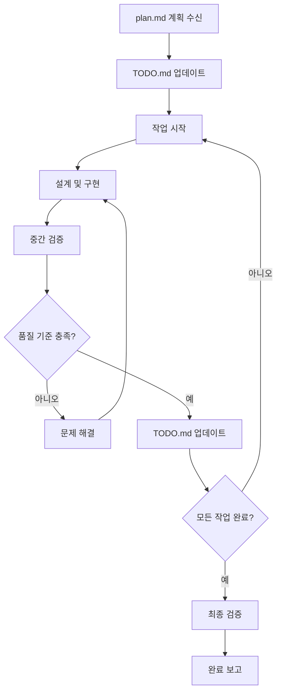
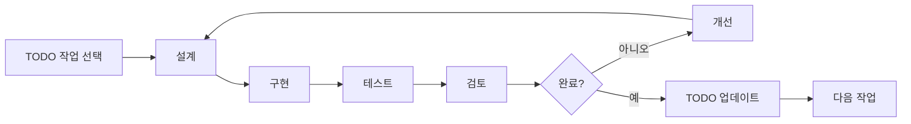
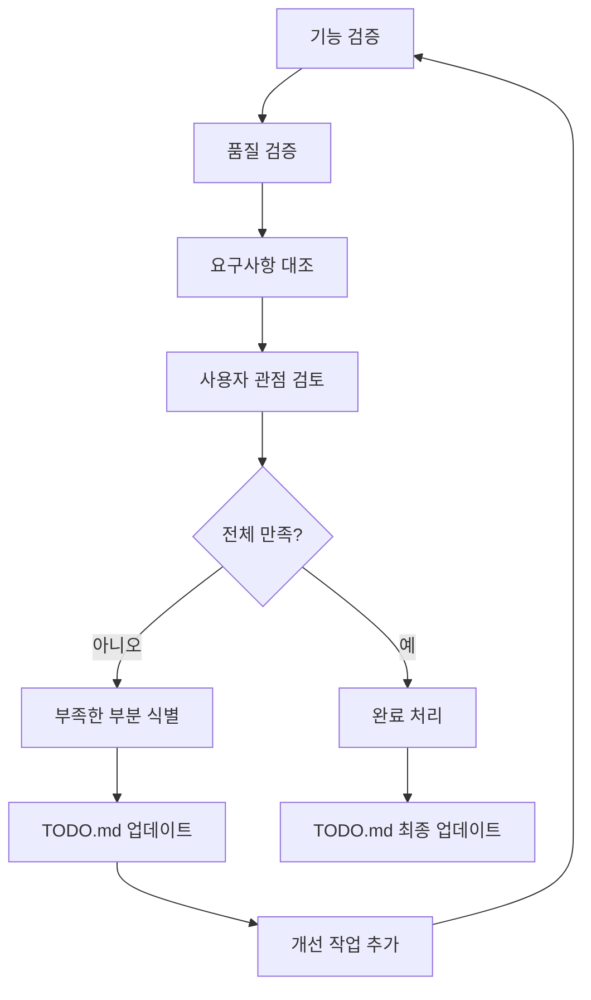
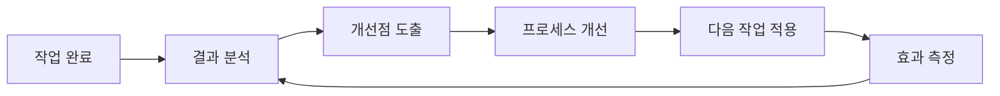

# 워크플로우 실행 가이드라인

ultrathink. 지금까지 설계된 워크플로우를 따라 실제 작업을 수행합니다.
아래 가이드라인을 지키며 작업을 수행하세요.

## 📋 목차

1. [실행 개요](#실행-개요)
2. [TODO.md 관리](#todo-md-관리)
3. [3단계: 설계 및 구현](#3단계-설계-및-구현)
4. [4단계: 검증 및 완료](#4단계-검증-및-완료)
5. [실행 품질 체크포인트](#실행-품질-체크포인트)
6. [지속적 개선](#지속적-개선)

## 실행 개요

### 핵심 철학
- **계획 준수**: plan.md에서 수립한 계획을 충실히 따름
- **품질 우선**: 각 작업의 품질을 최우선으로 고려
- **진행 투명성**: TODO.md를 통한 진행 상황 실시간 업데이트
- **유연한 대응**: 예상치 못한 상황에 대한 적절한 대응

### 실행 워크플로우 흐름



## TODO.md 관리

### TODO.md 실시간 업데이트 원칙

**작업 시작 시:**
```markdown
- [ ] → [🔄] 작업명 [시작시간] [담당자]
```

**작업 완료 시:**
```markdown
- [🔄] → [✅] 작업명 [실제소요시간] [완료시간]
```

**작업 중단/연기 시:**
```markdown
- [🔄] → [⏸️] 작업명 [중단이유] [예상재개시간]
```

**문제 발생 시:**
```markdown
- [🔄] → [❌] 작업명 [문제상황] [해결방안]
```

### TODO.md 자동 업데이트 전략

**단계별 업데이트:**
1. **작업 시작 전**: 다음 작업 선택 및 상태 변경
2. **작업 진행 중**: 주요 이정표 달성 시 노트 추가
3. **작업 완료 후**: 완료 표시 및 실제 소요 시간 기록
4. **문제 발생 시**: 즉시 상태 업데이트 및 해결 계획 기록

**진행률 추적:**
```markdown
## 전체 진행률
- 전체 작업: XX개
- 완료 작업: XX개 (XX%)
- 진행 중: XX개
- 대기 중: XX개

## 일정 현황
- 계획 완료일: YYYY-MM-DD
- 예상 완료일: YYYY-MM-DD
- 지연/앞당김: X일
```

## 3단계: 설계 및 구현

### 반복적 개발 사이클



### 설계 원칙

**단순성 우선:**
- 복잡한 해결책보다 단순하고 명확한 방법 선택
- 과도한 추상화 지양
- 이해하기 쉬운 구조 설계

**점진적 개선:**
- 동작하는 최소 버전부터 시작
- 단계별로 기능 추가 및 개선
- 각 단계에서 검증 후 진행

**재사용성 고려:**
- 유사한 문제에 적용 가능한 패턴 사용
- 모듈화된 구조 설계
- 확장 가능한 아키텍처 구성

### 구현 전략

**우선순위 기반 구현:**
1. **핵심 기능 먼저**: 가장 중요한 기능부터 구현
2. **의존성 순서**: 다른 기능이 의존하는 기반 기능 우선
3. **위험도 순서**: 기술적 위험이 높은 부분 먼저 검증

**품질 확보 방법:**
- 각 기능 완성 시마다 즉시 테스트
- 코드 리뷰 관점에서 자체 검토
- 예외 상황 및 에러 처리 포함
- TODO.md에 진행 상황 실시간 반영

### 작업 실행 템플릿

```markdown
## 현재 작업: [작업명]

### 목표
- 구체적 목표:
- 완료 기준:

### 접근 방법
1. 단계 1:
2. 단계 2:
3. 단계 3:

### 진행 상황
- [X] 설계 완료
- [ ] 구현 중 (30%)
- [ ] 테스트 예정
- [ ] 검토 예정

### 이슈 및 해결방안
- 이슈: 
- 해결방안:
```

## 4단계: 검증 및 완료

### 검증 프로세스



### 검증 체크리스트

**기능적 검증:**
- [ ] 모든 요구사항이 구현되었는가?
- [ ] 예상대로 동작하는가?
- [ ] 예외 상황이 적절히 처리되는가?
- [ ] TODO.md의 모든 항목이 완료되었는가?

**품질 검증:**
- [ ] 코드가 명확하고 이해하기 쉬운가?
- [ ] 성능이 요구사항을 만족하는가?
- [ ] 유지보수가 용이한가?
- [ ] 문서화가 충분한가?

**사용자 관점 검증:**
- [ ] 사용자가 원하는 결과를 제공하는가?
- [ ] 사용하기 편리한가?
- [ ] 문서나 설명이 충분한가?

### 완료 기준

**필수 완료 조건:**
- 모든 명시적 요구사항 충족
- 기본적인 품질 기준 만족
- 정상 동작 확인
- TODO.md의 모든 작업 완료

**선택적 개선 사항:**
- 성능 최적화
- 추가 기능 제안
- 확장성 개선

### 완료 보고서 템플릿

```markdown
# 작업 완료 보고서

## 프로젝트 개요
- 목표: [원래 목표]
- 완료일: YYYY-MM-DD
- 총 소요 시간: XX시간

## 완료된 작업
[TODO.md의 완료된 작업 목록]

## 주요 성과
- 성과 1:
- 성과 2:
- 성과 3:

## 품질 지표
- 기능 완성도: XX%
- 코드 품질: 양호/보통/개선필요
- 사용자 만족도: 예상 수준

## 학습된 교훈
- 잘된 점:
- 개선할 점:
- 다음 프로젝트 적용사항:

## 후속 작업 제안
- 즉시 필요한 작업:
- 향후 개선 사항:
```

## 실행 품질 체크포인트

### 작업 시작 시 검증
- [ ] plan.md의 계획이 명확히 이해되었는가?
- [ ] TODO.md가 최신 상태로 업데이트되었는가?
- [ ] 필요한 리소스와 도구가 준비되었는가?
- [ ] 작업 환경이 적절히 설정되었는가?

### 작업 진행 중 검증
- [ ] 계획대로 진행되고 있는가?
- [ ] TODO.md가 실시간으로 업데이트되고 있는가?
- [ ] 품질 기준을 만족하고 있는가?
- [ ] 예상 시간 내에 완료 가능한가?

### 작업 완료 시 검증
- [ ] 모든 요구사항이 충족되었는가?
- [ ] TODO.md의 모든 항목이 완료되었는가?
- [ ] 품질 기준을 만족하는가?
- [ ] 사용자 만족도가 높은가?

### 프로젝트 완료 시 검증
- [ ] 전체 목표가 달성되었는가?
- [ ] 완료 보고서가 작성되었는가?
- [ ] 후속 작업이 정리되었는가?
- [ ] 학습된 교훈이 문서화되었는가?

## 지속적 개선

### 피드백 루프



### 개선 영역

**효율성 개선:**
- 작업 시간 단축 방법
- 도구 활용 최적화
- 반복 작업 자동화

**품질 개선:**
- 검증 프로세스 강화
- 오류 예방 방법 개선
- 코드 리뷰 품질 향상

**프로세스 개선:**
- TODO.md 관리 방법 개선
- 계획 대비 실행 정확도 향상
- 의사소통 효율성 증대

### 성과 측정

**정량적 지표:**
- 계획 대비 실제 소요 시간
- 요구사항 충족률
- 품질 지표 (버그 수, 성능 등)

**정성적 지표:**
- 사용자 만족도
- 코드 가독성
- 유지보수 용이성

---

## 실행 가이드

### 작업 시작할 때
1. plan.md에서 전달받은 계획 검토
2. TODO.md 초기 설정 및 업데이트
3. 작업 환경 준비
4. 첫 번째 작업 선택 및 시작

### 작업 진행 중
- TODO.md 실시간 업데이트 유지
- 품질 체크포인트 준수
- 문제 발생 시 즉시 대응 및 기록
- 진척 상황 지속적 모니터링

### 작업 완료 시
- 최종 검증 철저히 수행
- TODO.md 완료 상태 업데이트
- 완료 보고서 작성
- 개선 사항 정리 및 다음 작업 준비

> 💡 **핵심 원칙**: 계획된 대로 실행하되, 상황에 따라 유연하게 대응하고, 모든 과정을 TODO.md에 투명하게 기록하여 추적 가능한 실행을 보장하세요.