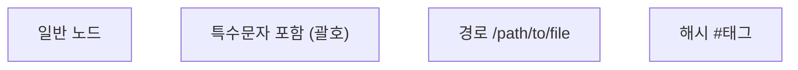
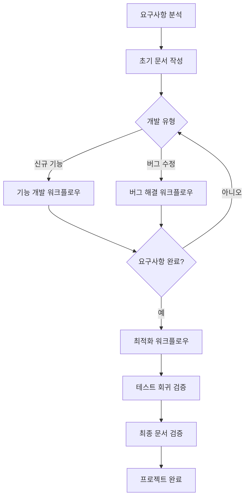
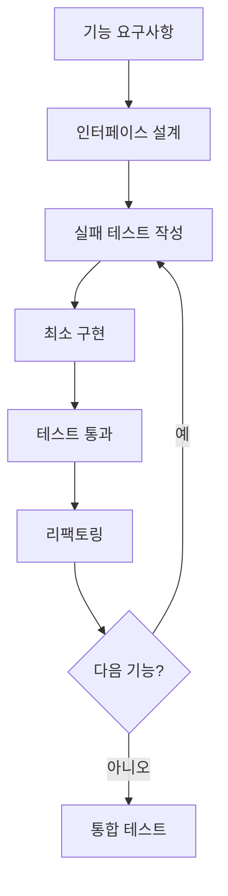
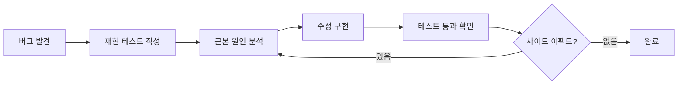
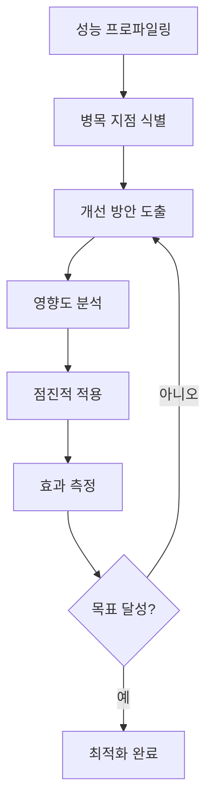

# 통합 개발 규칙 가이드라인

통합 개발 규칙에 따라 아래 작업을 완료하세요.

```text
// userinput
$ARGUMENTS
```

## 📋 목차

1. [핵심 원칙](#핵심-원칙)
2. [코드 품질 규칙](#코드-품질-규칙)
3. [테스트 전략 (FastTDD)](#테스트-전략-fasttdd)
4. [MCP 도구 활용 전략](#mcp-도구-활용-전략)
5. [파일 및 문서 관리](#파일-및-문서-관리)
6. [다이어그램 작성 규칙](#다이어그램-작성-규칙)
7. [개발 워크플로우](#개발-워크플로우)

## 핵심 원칙

### 1. 언어 규칙
- **모든 응답과 문서는 반드시 한국어로 작성**
- 기술 용어는 필요시 영어 병기 가능

### 2. 개발 철학
- **속도와 품질의 균형**: 빠른 개발 속도를 유지하되 품질 타협 불가
- **자동화 우선**: 반복 작업은 즉시 자동화
- **명확성 추구**: 코드는 자체 문서화되어야 함
- **실용주의**: 과도한 추상화보다 실용적 해결책 선호

## 코드 품질 규칙

### 1. 메서드 설계 원칙
```
✅ 메서드는 가급적 10줄 이하 유지
✅ 단일 책임 원칙(SRP) 엄격 준수
✅ 명확한 입출력 정의
```

### 2. 타입 안전성
```typescript
// ❌ 금지
function process(data: any) { }
function calculate(value: unknown) { }

// ✅ 권장
interface ProcessData {
  id: string;
  value: number;
}
function process(data: ProcessData) { }
```

**예외 상황:**
- 외부 API 통합 시 초기 단계
- 레거시 코드 마이그레이션 중

### 3. 조건부 로직 최소화

**❌ 피해야 할 패턴:**
```typescript
if (user.role === 'admin') {
  // 복잡한 로직
} else if (user.role === 'user') {
  // 다른 복잡한 로직
} else {
  // 또 다른 로직
}
```

**✅ 권장 패턴:**
```typescript
// Strategy Pattern 사용
const roleStrategies = {
  admin: new AdminStrategy(),
  user: new UserStrategy(),
  guest: new GuestStrategy()
};

roleStrategies[user.role].execute();
```

### 4. Guard Clause 활용
```typescript
// ❌ 중첩된 조건문
function processOrder(order) {
  if (order) {
    if (order.items.length > 0) {
      if (order.payment) {
        // 실제 로직
      }
    }
  }
}

// ✅ Guard Clause
function processOrder(order) {
  if (!order) return;
  if (order.items.length === 0) return;
  if (!order.payment) return;
  
  // 실제 로직
}
```

### 5. Tell, Don't Ask 원칙
```typescript
// ❌ Ask
if (account.getBalance() >= amount) {
  account.withdraw(amount);
}

// ✅ Tell
account.withdraw(amount); // 내부에서 검증 처리
```

## 테스트 전략 (FastTDD)

### 1. 테스트 피라미드
```
         /\
        /E2E\      (5% - 중요 사용자 경로만)
       /------\
      /Integration\ (25% - 모듈 간 상호작용)
     /------------\
    /   Unit Tests \ (70% - 격리된 단위 테스트)
   /________________\
```

### 2. 테스트 작성 기준

**✅ 반드시 테스트해야 할 것:**
- 핵심 비즈니스 로직
- 복잡한 알고리즘
- 에러 처리 로직
- 공개 API 인터페이스
- 중요한 상태 변환

**❌ 테스트 불필요:**
- 게터/세터
- 단순 위임 메서드
- 프레임워크 기능
- UI 스타일링
- 로깅

### 3. 테스트 품질 체크리스트
- [ ] 격리되어 있는가? (다른 테스트에 영향 없음)
- [ ] 반복 가능한가? (항상 같은 결과)
- [ ] 자체 검증 가능한가? (수동 확인 불필요)
- [ ] 시기적절한가? (코드 작성과 동시에)

## MCP 도구 활용 전략

### 1. 역량 중심 사고
도구 이름이 아닌 **필요한 역량**으로 접근:
- 기술 문서가 필요하다 → `context7` 활용
- 최신 정보가 필요하다 → `perplexity` 활용
- 웹페이지 내용이 필요하다 → `firecrawl` 활용

### 2. 도구별 최적 사용 사례

#### Context7 (기술 문서)
```
용도: 라이브러리/프레임워크 정확한 사용법
예시: React hooks 사용법, Next.js 라우팅 구현
장점: 공식 문서 기반 정확한 정보
```

#### Perplexity (실시간 검색)
```
용도: 최신 뉴스, 트렌드, 일반 정보
예시: 최신 기술 동향, 보안 이슈
장점: 출처 포함 실시간 정보
```

#### Firecrawl (웹 스크래핑)
```
용도: 특정 URL의 상세 내용 추출
예시: 블로그 포스트 요약, 제품 정보 수집
장점: 구조화된 데이터 추출
```

### 3. 실패 시 대체 전략
- MCP 도구 실패 → 내부 지식 활용 + 명확한 한계 고지
- 부분 정보만 획득 → 획득한 정보로 최선의 답변 구성
- 완전 실패 → 대체 접근 방법 제시

## 파일 및 문서 관리

### 1. 문서 구조화 원칙
- **명명 규칙**: 모든 파일/폴더는 `snake_case`
- **중복 제거**: 같은 내용은 하나의 문서로 통합
- **버전 관리**: 구식 문서는 즉시 삭제 및 다른 문서로 마이그레이션

### 3. 문서 최적화 워크플로우
1. **초기 평가**: 전체 문서 스캔 및 분류
2. **전략 수립**: 생성/수정/통합/삭제 결정
3. **실행**: 계획에 따라 체계적 실행
4. **검증**: 결과물 일관성 확인

## 다이어그램 작성 규칙

### Mermaid 다이어그램 핵심 규칙

**특수 문자 처리 (필수):**


**금지 사항:**
- 주석 (`%%`) 사용 금지
- 노드 ID에 특수문자 사용 금지
- 불필요한 설명 텍스트 추가 금지

**권장 사항:**
- 노드 ID는 영숫자와 언더스코어만 사용
- 복잡한 텍스트는 항상 큰따옴표로 감싸기
- 완전한 코드 블록만 제공

## 개발 워크플로우

### 전체 개발 프로세스 흐름



### 1. 요구사항 분석 단계

**체계적 요구사항 파악:**


**분석 체크리스트:**
- [ ] 비즈니스 목표 명확화
- [ ] 기능적/비기능적 요구사항 구분
- [ ] 의존성 및 제약사항 파악
- [ ] 측정 가능한 성공 지표 설정
- [ ] 리스크 요소 식별

### 2. 문서 작성 워크플로우

**요구사항 기반 문서화:**

1. **초기 문서 생성**
   - 프로젝트 개요
   - 기능 명세서
   - API 설계 문서
   - 테스트 계획서

2. **지속적 업데이트**
   - 개발 진행에 따른 실시간 반영
   - 변경사항 추적 및 버전 관리
   - 이해관계자 검토 및 승인

### 3. 개발 워크플로우 (반복)

#### A. 기능 개발 워크플로우



**TDD 사이클:**
1. **Red**: 실패하는 테스트 작성
2. **Green**: 테스트 통과하는 최소 코드
3. **Refactor**: 코드 품질 개선

#### B. 버그 해결 워크플로우



**버그 해결 원칙:**
- 버그를 재현하는 테스트 우선 작성
- 근본 원인에 집중 (증상 치료 X)
- 리그레션 방지 테스트 추가

### 4. 최적화 워크플로우

**요구사항 완료 후 품질 개선:**



**최적화 영역:**
- **성능**: 응답 시간, 처리량, 리소스 사용
- **코드 품질**: 중복 제거, 복잡도 감소
- **유지보수성**: 모듈화, 문서화 개선
- **확장성**: 아키텍처 개선

### 5. 테스트 회귀 검증

**전체 시스템 안정성 확인:**

```
1. 단위 테스트 전체 실행
2. 통합 테스트 실행
3. E2E 테스트 실행
4. 성능 테스트 실행
5. 보안 취약점 스캔
```

**검증 기준:**
- [ ] 모든 기존 테스트 통과
- [ ] 새로운 기능 테스트 포함
- [ ] 성능 기준선 유지/개선
- [ ] 0 크리티컬 이슈

### 6. 최종 문서 검증

**프로젝트 완료 전 문서 정리:**


**문서 체크리스트:**
- [ ] README 최신화
- [ ] API 문서 완성
- [ ] 설치/배포 가이드
- [ ] 트러블슈팅 가이드
- [ ] 변경 이력 정리

### 워크플로우 실행 팁

1. **반복 주기는 짧게**
   - 일일 단위로 진척 확인
   - 주 단위로 큰 마일스톤 설정

2. **피드백 루프 최소화**
   - 자동화된 테스트로 즉시 검증
   - CI/CD 파이프라인 활용

3. **문서는 코드와 함께**
   - 코드 변경 시 문서도 즉시 업데이트
   - 문서도 버전 관리 대상

4. **품질 기준 타협 금지**
   - 테스트 커버리지 기준 유지
   - 코드 리뷰 필수
   - 성능 기준선 준수

**팀 개발 시 준수 사항:**

1. **커밋 전 체크리스트**
   - [ ] 모든 테스트 통과
   - [ ] 코드 품질 규칙 준수
   - [ ] 불필요한 파일 제거
   - [ ] 의미 있는 커밋 메시지

2. **코드 리뷰 준비**
   - PR 설명에 컨텍스트 포함
   - 주요 변경사항 하이라이트
   - 테스트 결과 첨부
   - 성능 영향 명시

3. **피드백 반영**
   - 각 피드백을 개별 커밋으로
   - 변경 이유 명확히 기록
   - 추가 테스트 필요 시 즉시 작성

---


> 💡 **핵심 메시지**: 이 규칙들은 단순한 가이드라인이 아닌, 고품질 소프트웨어를 빠르고 효율적으로 개발하기 위한 실전 전략입니다. 각 규칙은 실제 개발 경험에서 검증된 것들이며, 상황에 따라 유연하게 적용하되 핵심 원칙은 반드시 지켜야 합니다.