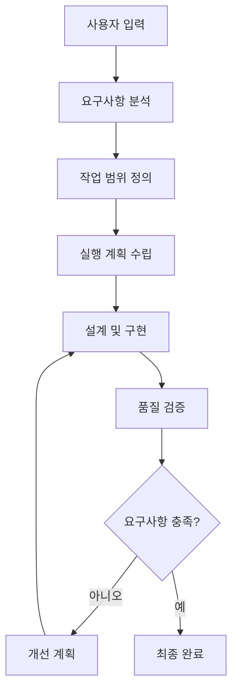
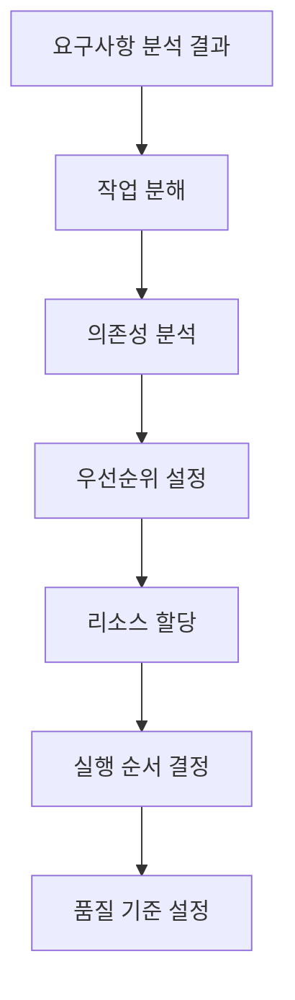
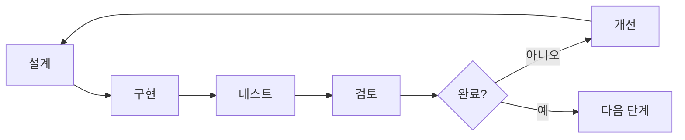
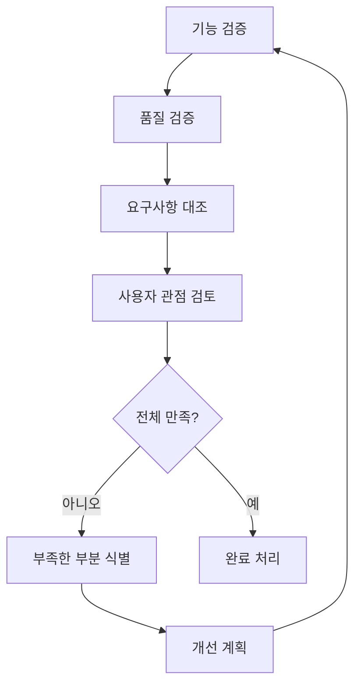
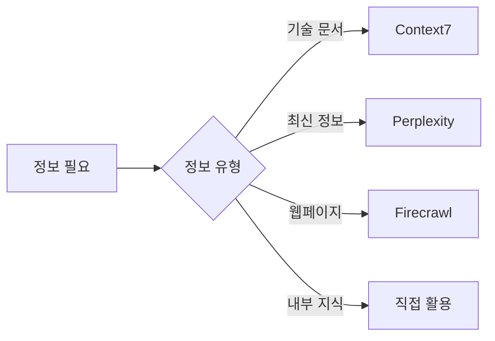

# 워크플로우 중심 개발 가이드라인

```text
$ARGUMENTS
```

위 요구사항을 분석하여 워크플로우를 설계하고, 작업을 수행합니다. ultrathink.


## 📋 목차

1. [워크플로우 개요](#워크플로우-개요)
2. [1단계: 요구사항 분석](#1단계-요구사항-분석)
3. [2단계: 작업 계획 수립](#2단계-작업-계획-수립)
4. [3단계: 설계 및 구현](#3단계-설계-및-구현)
5. [4단계: 검증 및 완료](#4단계-검증-및-완료)
6. [도구 활용 전략](#도구-활용-전략)
7. [품질 체크포인트](#품질-체크포인트)

## 워크플로우 개요

### 핵심 철학
- **체계적 접근**: 모든 작업은 정해진 단계를 따름
- **반복 가능성**: 동일한 프로세스로 일관된 결과 보장
- **품질 우선**: 각 단계마다 품질 검증점 설정
- **실용적 완료**: 요구사항 충족을 최우선으로 함

### 전체 워크플로우 흐름



## 1단계: 요구사항 분석

### 요구사항 파악 프로세스


### 분석 체크리스트
- [ ] **핵심 목표**: 사용자가 최종적으로 원하는 것은?
- [ ] **구체적 요구사항**: 명시된 기능이나 결과물은?
- [ ] **숨겨진 요구사항**: 언급되지 않았지만 필요한 것은?
- [ ] **제약사항**: 기술적/시간적/품질적 제한은?
- [ ] **완료 기준**: 언제 작업이 완료된 것인가?

### 요구사항 분류

**즉시 실행형 작업:**
- 코드 작성/수정 요청
- 문서 생성/업데이트
- 특정 기능 구현

**연구형 작업:**
- 기술 조사 및 분석
- 설계 방안 검토
- 최적화 방법 탐색

**복합형 작업:**
- 프로젝트 전체 구조 설계
- 다단계 구현 작업
- 통합 시스템 개발

## 2단계: 작업 계획 수립

### 계획 수립 프로세스



### 작업 분해 전략

**Top-Down 접근:**
1. 최종 목표 정의
2. 주요 구성 요소 식별
3. 세부 작업 단위로 분해
4. 실행 가능한 단위까지 분할

**우선순위 매트릭스:**
```
긴급함 | 중요함 → 즉시 실행
긴급함 | 덜 중요 → 빠른 처리
덜 긴급 | 중요함 → 계획적 실행
덜 긴급 | 덜 중요 → 나중에 처리
```

### 실행 계획 템플릿

```markdown
## 작업 계획서

### 1. 목표
- 주요 목표:
- 세부 목표:

### 2. 작업 단위
- [ ] 작업 1: [예상 시간]
- [ ] 작업 2: [예상 시간]
- [ ] 작업 3: [예상 시간]

### 3. 의존성
- 작업 A → 작업 B
- 외부 의존성:

### 4. 완료 기준
- 기능적 기준:
- 품질 기준:
```

## 3단계: 설계 및 구현

### 반복적 개발 사이클



### 설계 원칙

**단순성 우선:**
- 복잡한 해결책보다 단순하고 명확한 방법 선택
- 과도한 추상화 지양
- 이해하기 쉬운 구조 설계

**점진적 개선:**
- 동작하는 최소 버전부터 시작
- 단계별로 기능 추가 및 개선
- 각 단계에서 검증 후 진행

**재사용성 고려:**
- 유사한 문제에 적용 가능한 패턴 사용
- 모듈화된 구조 설계
- 확장 가능한 아키텍처 구성

### 구현 전략

**우선순위 기반 구현:**
1. **핵심 기능 먼저**: 가장 중요한 기능부터 구현
2. **의존성 순서**: 다른 기능이 의존하는 기반 기능 우선
3. **위험도 순서**: 기술적 위험이 높은 부분 먼저 검증

**품질 확보 방법:**
- 각 기능 완성 시마다 즉시 테스트
- 코드 리뷰 관점에서 자체 검토
- 예외 상황 및 에러 처리 포함

## 4단계: 검증 및 완료

### 검증 프로세스



### 검증 체크리스트

**기능적 검증:**
- [ ] 모든 요구사항이 구현되었는가?
- [ ] 예상대로 동작하는가?
- [ ] 예외 상황이 적절히 처리되는가?

**품질 검증:**
- [ ] 코드가 명확하고 이해하기 쉬운가?
- [ ] 성능이 요구사항을 만족하는가?
- [ ] 유지보수가 용이한가?

**사용자 관점 검증:**
- [ ] 사용자가 원하는 결과를 제공하는가?
- [ ] 사용하기 편리한가?
- [ ] 문서나 설명이 충분한가?

### 완료 기준

**필수 완료 조건:**
- 모든 명시적 요구사항 충족
- 기본적인 품질 기준 만족
- 정상 동작 확인

**선택적 개선 사항:**
- 성능 최적화
- 추가 기능 제안
- 확장성 개선

## 도구 활용 전략

### 상황별 도구 선택

**정보 수집이 필요한 경우:**


**도구 활용 우선순위:**
1. **내부 지식 우선**: 확실히 아는 내용은 즉시 활용
2. **적절한 도구 선택**: 정보 유형에 맞는 도구 사용
3. **실패 시 대안**: 도구 실패 시 내부 지식으로 대응

### 효율적 정보 활용

**정보 수집 전략:**
- 구체적이고 정확한 검색어 사용
- 여러 소스에서 정보 교차 검증
- 최신성과 신뢰성 고려

**정보 활용 방법:**
- 핵심 내용만 추출하여 활용
- 출처 명시 및 신뢰도 표시
- 불확실한 정보는 명시적으로 표현

## 품질 체크포인트

### 단계별 품질 검증

**1단계 완료 시:**
- [ ] 요구사항이 명확히 파악되었는가?
- [ ] 놓친 부분은 없는가?
- [ ] 우선순위가 적절한가?

**2단계 완료 시:**
- [ ] 실행 가능한 계획인가?
- [ ] 현실적인 일정인가?
- [ ] 품질 기준이 명확한가?

**3단계 완료 시:**
- [ ] 설계가 요구사항을 반영하는가?
- [ ] 구현이 설계를 따르는가?
- [ ] 테스트가 충분한가?

**4단계 완료 시:**
- [ ] 모든 요구사항이 충족되었는가?
- [ ] 사용자 만족도가 높은가?
- [ ] 향후 유지보수가 가능한가?

### 지속적 개선

**피드백 루프:**


**개선 영역:**
- 요구사항 분석 정확도 향상
- 계획 수립 효율성 개선
- 구현 품질 향상
- 검증 프로세스 강화

---

## 워크플로우 실행 가이드

### 시작할 때
1. 사용자 입력을 신중히 분석
2. 불명확한 부분은 즉시 확인
3. 전체 계획을 먼저 수립
4. 단계별로 체계적 실행

### 진행 중
- 각 단계의 완료 기준 확인
- 품질 체크포인트 준수
- 문제 발생 시 즉시 대응
- 진척 상황 지속적 모니터링

### 완료 시
- 최종 검증 철저히 수행
- 사용자 관점에서 재검토
- 개선 가능한 부분 식별
- 다음 작업을 위한 피드백 정리

> 💡 **핵심 원칙**: 이 워크플로우는 단순한 절차가 아닌, 고품질 결과물을 일관되게 만들어내는 사고 체계입니다. 상황에 따라 유연하게 적용하되, 각 단계의 핵심 목적은 반드시 달성해야 합니다.