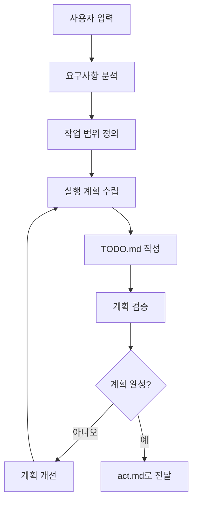
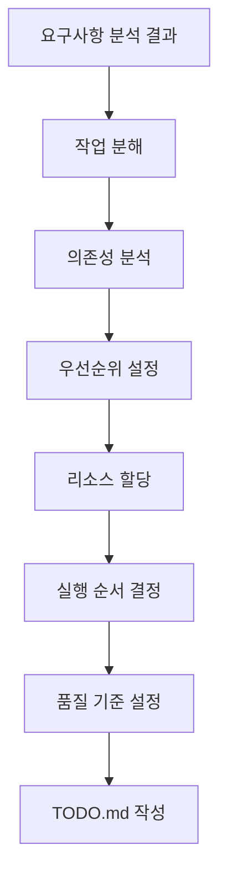
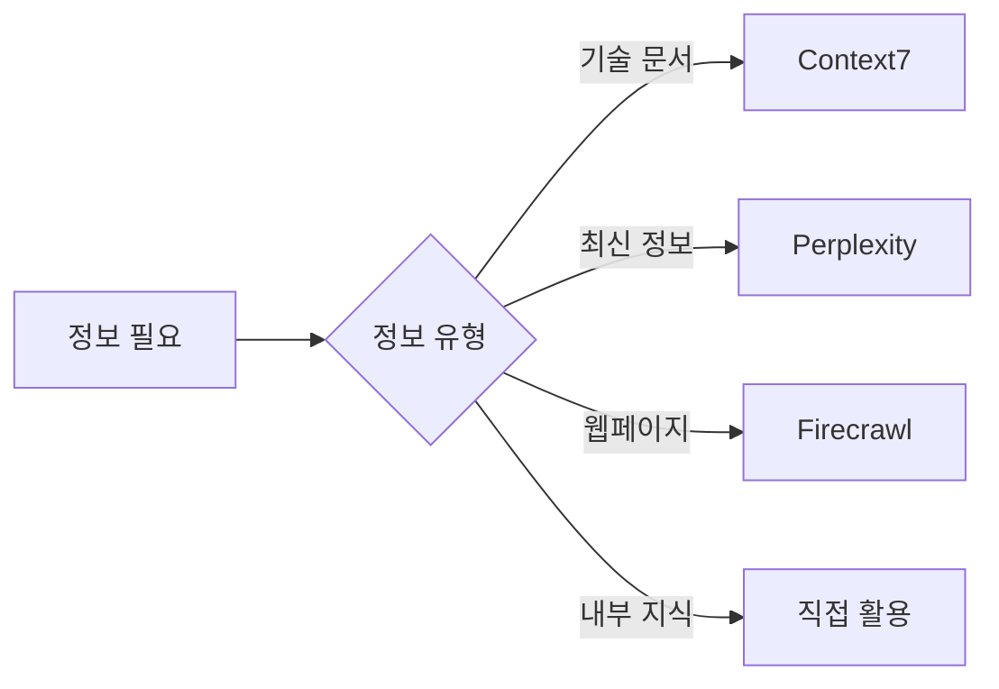

# 워크플로우 계획 수립 가이드라인

```text
$ARGUMENTS
```

ultrathink: 위 요구사항을 분석하여 워크플로우를 설계합니다.
아래 가이드라인을 지키며 작업을 수행하세요.

## 📋 목차

1. [계획 수립 개요](#계획-수립-개요)
2. [1단계: 요구사항 분석](#1단계-요구사항-분석)
3. [2단계: 작업 계획 수립](#2단계-작업-계획-수립)
4. [도구 활용 전략](#도구-활용-전략)
5. [계획 품질 체크포인트](#계획-품질-체크포인트)

## 계획 수립 개요

### 핵심 철학
- **체계적 접근**: 모든 작업은 정해진 단계를 따름
- **반복 가능성**: 동일한 프로세스로 일관된 결과 보장
- **품질 우선**: 각 단계마다 품질 검증점 설정
- **실용적 완료**: 요구사항 충족을 최우선으로 함

### 계획 수립 흐름



## 1단계: 요구사항 분석

### 요구사항 파악 프로세스


### 분석 체크리스트
- [ ] **핵심 목표**: 사용자가 최종적으로 원하는 것은?
- [ ] **구체적 요구사항**: 명시된 기능이나 결과물은?
- [ ] **숨겨진 요구사항**: 언급되지 않았지만 필요한 것은?
- [ ] **제약사항**: 기술적/시간적/품질적 제한은?
- [ ] **완료 기준**: 언제 작업이 완료된 것인가?

### 요구사항 분류

**즉시 실행형 작업:**
- 코드 작성/수정 요청
- 문서 생성/업데이트
- 특정 기능 구현

**연구형 작업:**
- 기술 조사 및 분석
- 설계 방안 검토
- 최적화 방법 탐색

**복합형 작업:**
- 프로젝트 전체 구조 설계
- 다단계 구현 작업
- 통합 시스템 개발

## 2단계: 작업 계획 수립

### 계획 수립 프로세스



### 작업 분해 전략

**Top-Down 접근:**
1. 최종 목표 정의
2. 주요 구성 요소 식별
3. 세부 작업 단위로 분해
4. 실행 가능한 단위까지 분할

**우선순위 매트릭스:**
```
긴급함 | 중요함 → 즉시 실행
긴급함 | 덜 중요 → 빠른 처리
덜 긴급 | 중요함 → 계획적 실행
덜 긴급 | 덜 중요 → 나중에 처리
```

### 실행 계획 템플릿

```markdown
## 작업 계획서

### 1. 목표
- 주요 목표:
- 세부 목표:

### 2. 작업 단위
- [ ] 작업 1: [예상 시간] [의존성] [우선순위]
- [ ] 작업 2: [예상 시간] [의존성] [우선순위]
- [ ] 작업 3: [예상 시간] [의존성] [우선순위]

### 3. 의존성
- 작업 A → 작업 B
- 외부 의존성:

### 4. 완료 기준
- 기능적 기준:
- 품질 기준:

### 5. 위험 요소
- 기술적 위험:
- 일정 위험:
- 품질 위험:
```

### TODO.md 작성 가이드

**TODO.md 구조:**
```markdown
# 작업 목록

## 프로젝트 개요
- 목표:
- 완료 기준:
- 예상 완료 시간:

## 우선순위별 작업

### 🔴 높은 우선순위 (즉시 실행)
- [ ] 작업명 [예상시간] [담당자] [완료기한]

### 🟡 중간 우선순위 (계획적 실행)
- [ ] 작업명 [예상시간] [담당자] [완료기한]

### 🟢 낮은 우선순위 (여유있을 때)
- [ ] 작업명 [예상시간] [담당자] [완료기한]

## 완료된 작업
- [x] 완료된 작업명 [실제소요시간] [완료일]

## 참고사항
- 주의할 점:
- 참고 문서:
```

## 도구 활용 전략

### 상황별 도구 선택

**정보 수집이 필요한 경우:**


**도구 활용 우선순위:**
1. **내부 지식 우선**: 확실히 아는 내용은 즉시 활용
2. **적절한 도구 선택**: 정보 유형에 맞는 도구 사용
3. **실패 시 대안**: 도구 실패 시 내부 지식으로 대응

### 효율적 정보 활용

**정보 수집 전략:**
- 구체적이고 정확한 검색어 사용
- 여러 소스에서 정보 교차 검증
- 최신성과 신뢰성 고려

**정보 활용 방법:**
- 핵심 내용만 추출하여 활용
- 출처 명시 및 신뢰도 표시
- 불확실한 정보는 명시적으로 표현

## 계획 품질 체크포인트

### 1단계 완료 시 검증
- [ ] 요구사항이 명확히 파악되었는가?
- [ ] 놓친 부분은 없는가?
- [ ] 우선순위가 적절한가?
- [ ] 완료 기준이 구체적인가?

### 2단계 완료 시 검증
- [ ] 실행 가능한 계획인가?
- [ ] 현실적인 일정인가?
- [ ] 품질 기준이 명확한가?
- [ ] 의존성이 정확히 파악되었는가?

### TODO.md 품질 검증
- [ ] 모든 작업이 실행 가능한 단위로 분해되었는가?
- [ ] 우선순위가 명확히 설정되었는가?
- [ ] 예상 시간이 현실적인가?
- [ ] 완료 기준이 구체적인가?

### 최종 계획 검증
- [ ] 전체 계획이 요구사항을 충족하는가?
- [ ] 작업 순서가 논리적인가?
- [ ] 위험 요소가 식별되고 대응책이 있는가?
- [ ] act.md로 전달할 준비가 되었는가?

---

## 계획 수립 실행 가이드

### 계획 수립 시작할 때
1. 사용자 입력을 신중히 분석
2. 불명확한 부분은 즉시 확인
3. 전체 목표를 명확히 정의
4. 체계적으로 분해하여 계획 수립

### 계획 수립 진행 중
- 각 단계의 완료 기준 확인
- 품질 체크포인트 준수
- 논리적 일관성 유지
- 실행 가능성 지속적 검토

### 계획 완료 시
- 최종 검증 철저히 수행
- TODO.md 품질 확인
- act.md로 전달 준비
- 실행 과정에서의 피드백 반영 계획

> 💡 **핵심 원칙**: 완벽한 계획이 성공적인 실행의 기반입니다. 충분한 시간을 투자하여 세밀하고 실행 가능한 계획을 수립하세요.